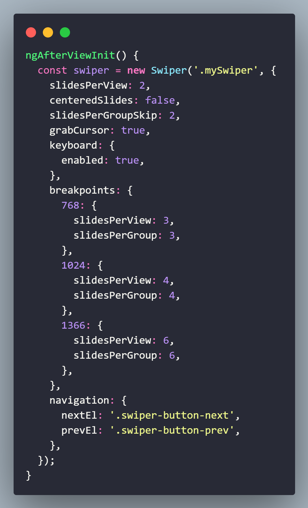

## 🏋️‍♂️ Projeto Angular + TypeScript + CSS.  

Clone da página PlayStation Store.   

Os temas abordados são: 

- Utilização da biblioteca Swiper.
- Componentes do Angular.
- Criação de elementos dinamicamente com a diretiva NgFor.
- Dimensionamento de elementos com cálculo para melhor responsividade.
- Responsividade priorizando mobile first. 

## 💻 Tecnologias utilizadas nesse projeto:

  
  
  
  

## Estrutura do Projeto:

- **src/**
  - **app/**
    - **components/**
      - **banner/**
      - **card/**
      - **footer/**
      - **jogos-mensais/**
      - **menu-bar/**
      - **preview/**
      - **swiper/**
    - **pages/home/**
  - **assets/**
    - **Arquivos de imagens**
  - **index.html:** Arquivo HTML de encabeçamento.

## Funcionalidades:

- Menu responsivo para telas menores.
- Swiper deslizante.

## Resumo :

`Swiper`: Biblioteca para criar sliders e carrosséis responsivos e interativos.

Instalação: `npm install swiper`

Importação: `import Swiper from 'swiper';` 

ngOnInit(): void { ... }

Método do ciclo de vida do Angular chamado ao inicializar o componente. Aqui, ele popula o array dados com categorias e listas de jogos a partir dos dados importados.

ngAfterViewInit() { ... }

Método do ciclo de vida do Angular chamado após a visualização do componente ter sido completamente inicializada.

const swiper = new Swiper('.mySwiper', { ... });: Inicializa o Swiper com configurações para slides, navegação e quebra de pontos responsivos baseados na largura da tela.

Configurações do Swiper:

**slidesPerView**: Número de slides visíveis ao mesmo tempo. 

**centeredSlides**: Define se os slides são centralizados. 

**slidesPerGroupSkip**: Número de slides a serem pulados ao navegar para frente. 

**grabCursor**: Adiciona um cursor de mão ao passar sobre os slides. 

**keyboard**: Habilita navegação com o teclado. 

**breakpoints**: Define diferentes configurações para diferentes larguras de tela:

- 768px: 3 slides por vez.
- 1024px: 4 slides por vez.
- 1366px: 6 slides por vez.
  
**navigation**: Configura os botões de navegação para avançar e retroceder os slides. 

## 💻 Preview:
- Veja como ficou o projeto acessando: [Link](https://angular-ps-store-smi3.vercel.app/)
  

## 📄 Documentação:
- Documentação da biblioteca Swiper: [Link](https://swiperjs.com/get-started)
